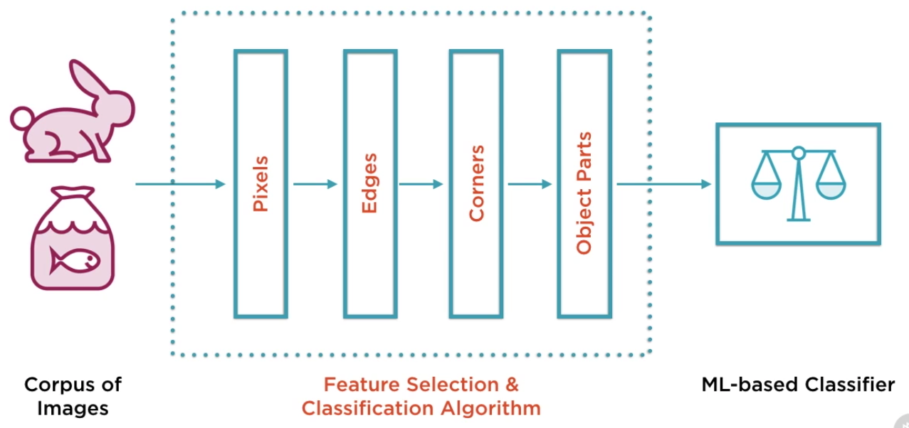
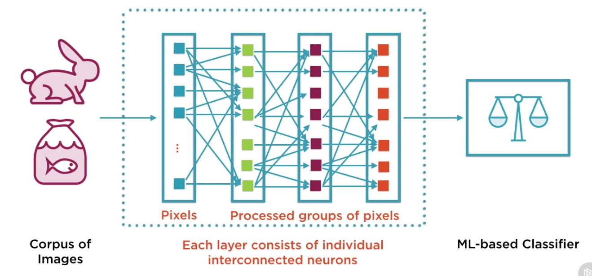
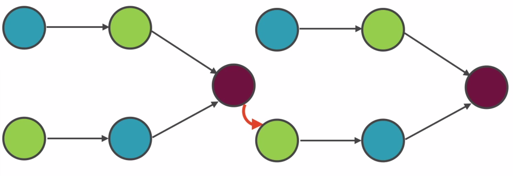
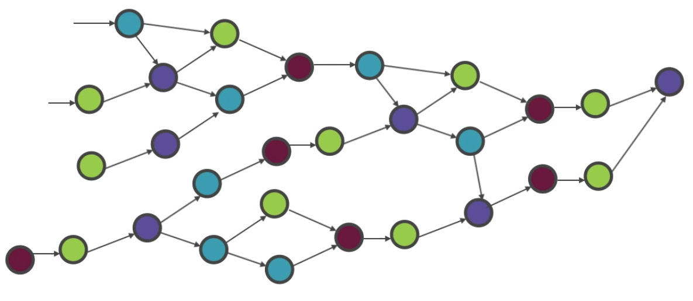
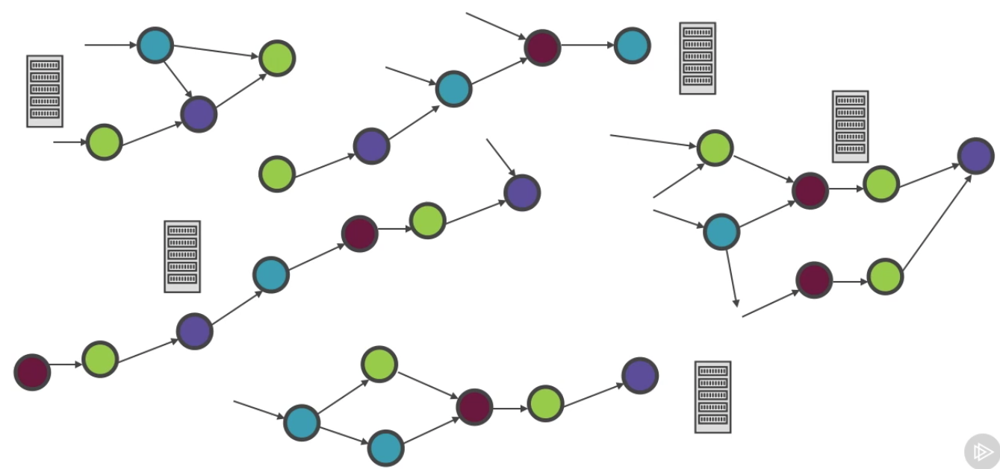
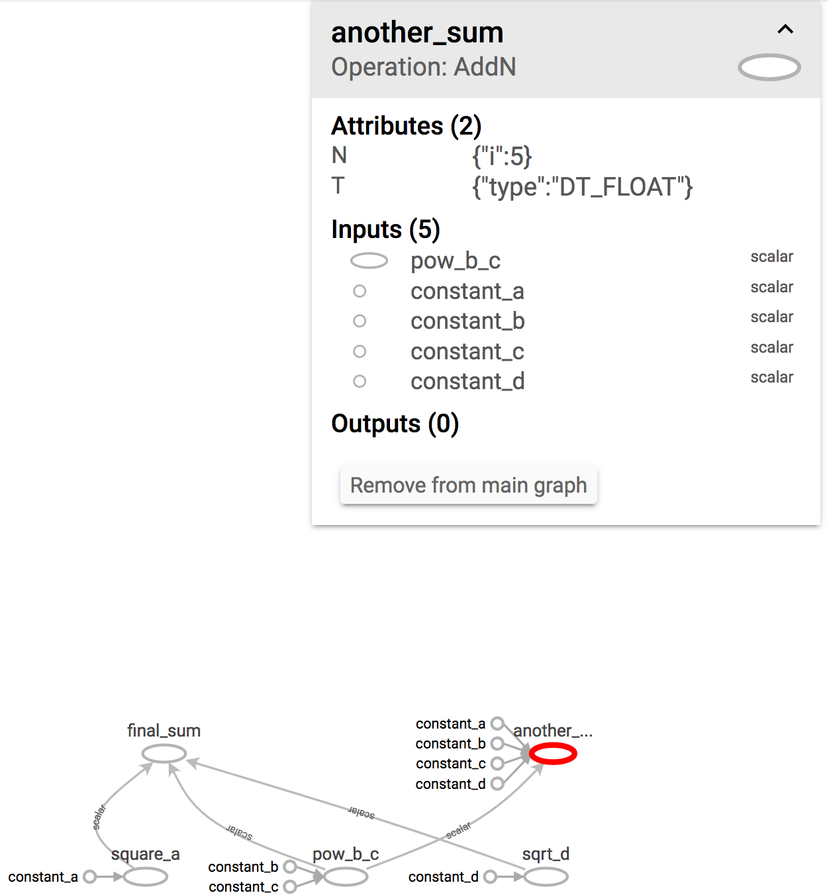
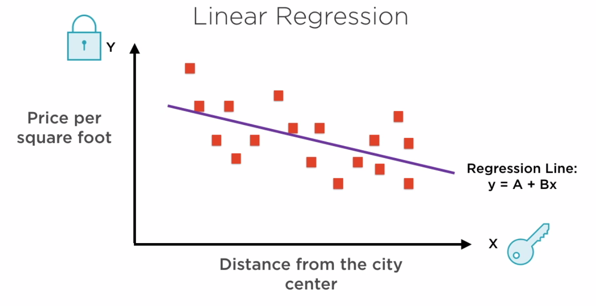
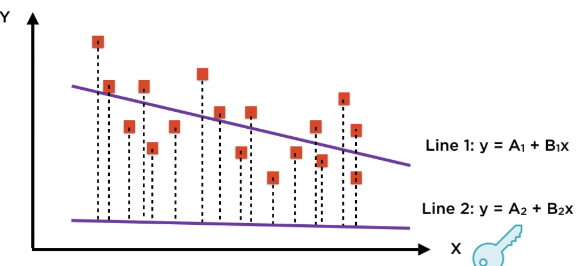
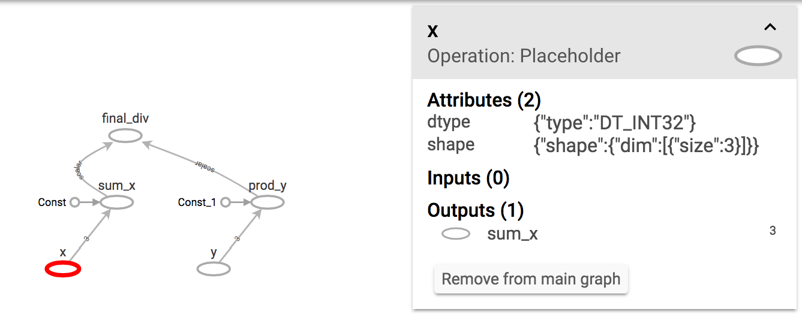

<!-- START doctoc generated TOC please keep comment here to allow auto update -->
<!-- DON'T EDIT THIS SECTION, INSTEAD RE-RUN doctoc TO UPDATE -->
**Table of Contents**  *generated with [DocToc](https://github.com/thlorenz/doctoc)*

- [Understanding the Foundations of TensorFlow](#understanding-the-foundations-of-tensorflow)
  - [Introducing TensorFlow](#introducing-tensorflow)
    - [Traditional ML Algorithms](#traditional-ml-algorithms)
    - [Representation ML Algorithms](#representation-ml-algorithms)
    - [Deep Learning and Neural Networks](#deep-learning-and-neural-networks)
    - [Introducing TensorFlow](#introducing-tensorflow-1)
    - [The World as a Graph](#the-world-as-a-graph)
    - [Install TF](#install-tf)
  - [Introducing Computation Graphs](#introducing-computation-graphs)
    - [The Computation Graph](#the-computation-graph)
    - [Cyclical Dependencies in ML](#cyclical-dependencies-in-ml)
    - [Building and Running Graphs](#building-and-running-graphs)
      - [Visualizing Graph](#visualizing-graph)
    - [Modeling Computations as Graphs](#modeling-computations-as-graphs)
    - [Demo: Simple Math Operations](#demo-simple-math-operations)
    - [Tensors](#tensors)
  - [Digging Deeper into Fundamentals](#digging-deeper-into-fundamentals)
    - [Linear Regression](#linear-regression)
    - [Linear Regression Algorithms in Practice](#linear-regression-algorithms-in-practice)
    - [Placeholders](#placeholders)
    - [Fetches and the Feed Dictionary](#fetches-and-the-feed-dictionary)
    - [Variables](#variables)

<!-- END doctoc generated TOC please keep comment here to allow auto update -->

# Understanding the Foundations of TensorFlow

> My notes from this Pluralsight [course](https://app.pluralsight.com/library/courses/tensorflow-understanding-foundations/table-of-contents)

## Introducing TensorFlow

### Traditional ML Algorithms

TensorFlow (TF) primarily used for machine learning (ML).

Programs capable of dealing with huge datasets, find patterns, and extract info useful for making decisions.

ML algorithm is able to:
- learn from data
- make predictions
- course correct -> fix itself if predictions are wrong

Eg: Classify emails on a server - spam or ham? Uses data about what emails user has read or marked as spam to determine if future emails are relevant or not.

Eg: Image recognition. Images represented as pixels in color or grey scale. ML algorithms can recognize edges, colors and shapes to find patterns, to identify what a given image shows.

**Types of ML Problems**

- Classification: Assigning labels to elements or events
- Regression: Fit a line or curve on existing data, then use that line/curve to predict values of new data
- Clustering: Divide data into groups based on how similar they are
- Rule-extraction: Find if/then patterns in data, eg: if customer regularly buys books, are they also likely to place an order fo reading glasses?

**Classification Example: Whales - Fish or Mammals?**

Mammals: Members of the infraorder Cetacea
Fish: Looks like fish, swim like fish, move with fish

**Rule-based Binary Classifier**

- Have many rules and see which rules whale satisfies.
- Requires human experts to make up the rules that apply to classification of animals.
- Input to classifier is whale.
- Apply rules, eg: "Mammals give birth to young", "Feed their young for a period of time".
- Whale matches these criteria -> classified as mammal.
- Static - does not change based on new information.
- Corpus of data is optional.
- No training step.

**ML-based Binary Classifier**

- Don't have human experts making up rules.
- ML based classifier requires large corpus of pre-existing data that has been labelled correctly and tries to extract meaningful information from it, such as what characteristics mammals should have vs what characteristics fish have.
- Apply classifier to input.
- Features specified about the input are critical. *Feature Vector* Eg: if tell ML that whale breathes air, gives birth and feeds its young, then ML classifier will determine "whale is mammal"...
- But can mislead the ML classifier by specifying that whale swims like a fish and looks like a fish, then  will determine "whale is fish".
- Dynamic, identifies new patterns as its exposed to newer and more data.
- Human experts optional.
- Training step required where algorithm processes corpus of data to output classifier.
- Output of classifier is *Label*, category that element falls into.

**Feature Vectors**

- Composed of all attributes of the input element to be classified, that the ML algorithm should *focus* on when it runs.
- Each data point is a list (aka *vector*) of features.

***Traditional*** ML-based systems rely on human experts to decide what features to pay attention to.


### Representation ML Algorithms

***Representation*** ML-based systems figure out by themselves what features to pay attention to.

Feature Selection Algorithm replaces human experts. Determines what feature vector should serve as input to classifier.

***Deep Learning*** systems are one type of representation systems. Learns which features are important to make predictions.

### Deep Learning and Neural Networks

Class of algorithms focused on determining what features are important for a given problem set.
Problem set could be anything but DL usually focused on speech and image recognition.

**Neural Networks**

- Commonly used alongside DL.
- A class of DL algorithms that focus on feature selection.
- Composed of core learning elements called *Neurons*: Simplest element having ability to learn or understand patterns in corpus of data.

**Deep Learning-based Binary Classifier**


- DL systems composed of *layers*.
- Each layer focused on recognizing/finding one kind of pattern in corpus.
- Eg: image recognition system, first layer would focus on individual *Pixels*.
- Next layer could be finding *Edges*.
- Next layer could be finding *Corners* of objects.
- All patterns extracted in previous layers come together as *Object Parts*.
- This final layer puts all the parts together to identify image such as Bird, Animal, House, etc.
- *Visible layers*: Layers that have data fed directly into (eg: Pixel) and layer that directly outputs data (eg: Object Parts). i.e. layers that are interacted with.
- All other layers are *Hidden Layers*, do internal processing but their input and outputs are hidden to users of algorithm.

In neural network, can have any number `n` of layers. Made up of interconnected neurons. Neurons pass/receive input from adjacent layers to achive pattern recognition.



Neural networks find unknown patterns in massive data sets.

### Introducing TensorFlow

- OSS library.
- For numerical computation, not limited to ML but mostly used for that.
- Models all problems as *data flow graphs*.
- Graphs transform data as it flows through.
- Distributed - runs on cluster or multiple CPUs/GPUs on the same machine.
- Modelling problems as graphs leads to massively parallel operations.
- Suite of software: TensorFlow (programming language and API), TensorBoard (visualization tool runs in browser, view graphical model to see how data flows and is transformed by it), TensorFlow Serving (quickly productionize models build by TensorFlow).

**Uses**

- R&D of new ML algorithms.
- REPL supports rapid prototyping.
- Same model can go from training to production using same library (does not distinguish between dev/prod environments which means models can be moved to prod easily).
- Well suited to large scale distributed models - different portions of the same graph can be computed on different machines in a cluster.
- Can build models for mobile and embedded systems - can run with just a small amount of memory in a constrained environment.

**Strengths**

- Easy to use stable Python API.
- Runs well on large and small systems.
- Efficient and performant.
- Good support from Google.

**Challenges**

- Distributed support still has a ways to go.
- Libraries still being developed - requires code migration on new releases.
- Writing custom code is not straightforward.

### The World as a Graph

- Everything is a graph - nodes and edges.
- Programming in TF - building a graphical model of solution - *network*.
- Every node in graph is a computation.
- Computations act on data that flows into that node and produce a result that flows out of that node.
- Computations are called *Operators*.
- Edges that connect nodes are the data that flows through the graph.
- Data is transformed by nodes to produce new edges that move on to other nodes.
- Edges are called *Tensors*.
- Tensors flow through the graph and get transformed along the way.
- Tensors are n dimensional matricies used to represent arbitrarily complex datasets.

**Example**


- Value `1.8` flows through the `round` node, which computes `2`.
- `2` flows to multiple computation nodes `x` and `+`.
- Value `3.6` flows through `floor` node, which computes `3`.
- `3` flows to `+` node.
- `+` node now has both its inputs available `2` and `3` which it uses to compute `5`.
- `5` flows to `x` and `abs`.
- `x` node now has both its inputs available `2` and `5`, computes `10`, which flows to `+` node.
- `abs` node also has its input `5`, computes `5`, flows to `+`.
- last `+` node now has its inputs `10` and `5`, computes `15`.

**Notes**

- Computation for any node cannot be run until all its inputs are available.
- Every node transforms its inputs in a pre-defined manner associated with that node.
- Some nodes are independent of others and can be run in parallel.
- Every problem in TF as modelled like the above example.

### Install TF

Follow [instructions](https://www.tensorflow.org/install/) to download and install TF.

**Hello World TF**

Start python, then:

```python
>>> import tensorflow as tf
>>> hello = tf.constant('Hello, TensorFlow World!')
>>> sess = tf.Session() # Ignore cpu warnings
>>> print(sess.run(hello))
b'Hello, TensorFlow World!'
```

## Introducing Computation Graphs

### The Computation Graph

- Computation graph is how TF represents any model from the real world.
- TF graphs are directed-acyclic.
- Every edge points to a certain node, this is the direction in which data flows.
- Computational nodes depend on other nodes to forward data.
- Node can send its data to multiple nodes.
- Node can also receive inputs from multiple nodes, in which case it can only begin when all its inputs are available.
- Nodes which receive data from other nodes are *dependent* on those nodes.
- **Direct dependency:** One edge connecting one node to another.
- **Indirect dependency:** Several computations along the way.
- No cycles in the graph, otherwise will never finish computation.

### Cyclical Dependencies in ML

ML tends to have feedback loops, effectively a cycle. At the end of computation, ML algorithm calculates how accurate result is. If not good enough, feeds back into input to tweak parameters.

TF deals with this by *Unrolling the graph*. Rather than last node pointing back in to the graph, it points in to a *copy* of the graph.



Can repeat the process as many times as needed. ML is iterative algorithms which get closer and closer to intelligent decisions.

### Building and Running Graphs

2 Steps in a TF program:

1. Build graph: Specify operations and data.
1. Run graph: Execute graph to get final result.

Demo - open Python shell, then:

```python
>>> import tensorflow as tf
>>> ### CONSTRUCT GRAPH
>>> # setup 4 constants as input to computation graph
>>> a = tf.constant(6, name='constant_a')
>>> b = tf.constant(3, name='constant_b')
>>> c = tf.constant(10, name='constant_c')
>>> d = tf.constant(5, name='constant_d')
>>>
>>> # define computational nodes
>>> mul = tf.multiply(a, b, name='mul')
>>> div = tf.div(c, d, name='div')
>>> # this node depends on output of mul and div computations
>>> addn = tf.add_n([mul, div], name='addn)
>>>
>>> # this will NOT print value of computations
>>> print(addn)
Tensor("addn:0", shape=(), dtype=int32)
>>> print(a)
Tensor("constant_a:0", shape=(), dtype=int32)
>>>
>>> # RUN GRAPH
>>> sess = tf.Session()
>>> sess.run(addn)
20
```

Notes:
- Constants are *immutable*, once value is assigned, cannot be changed.
- Constants have a value (eg: 6, 3, 10, 5) but also *name* parameter (eg: constant_a) - used for identification of constant when visualized with TensorBoard.
- `a, b, c, d` are the *tensors* that will flow through the graph.
- `a, b, c, d` are edges in the graph.
- `mul` is a node specifying multiply operation, operates on `a` and `b`.
- Computational nodes can also be identified by name (eg: mul).
- `add_n` operation sums up elements in an array.
- Printing data provides name of tensor, shape and data type, but not the value that it holds because graph hasn't been run yet.
- Entire graph must be constructed first, before it can be executed, TF analyzes graph for optimization such as parallel paths.
- To run graph, need TF `Session` object - supervises execution of TF graph.
- To run any portion of a graph, invoke `run` method on session object, passing in node to be computed, can be invoked on final node or any intermediate node.

#### Visualizing Graph

Add instrumentation to code:

```python
>>> # write graph events to a log file directory
>>> writer = tf.summary.FileWriter('./logs/m2_example1', sess.graph)
>>> # cleanup
>>> writer.close()
>>> sess.close()
```

Notes:
- First agrument to `FileWriter` is directory where events should be written, second argument is what you want to write out, in this example, the graph representation.
- `writer` and `sess` are handles to resources and should be closed to avoid memory leaks.
- `ls logs/m2_example1` to see what FileWriter generated.
- run from shell `tensorboard --logdir="logs/m2_example1"`, then open `http://localhost:6006` in browser.

### Modeling Computations as Graphs

Real world graphs are not built by hand but rather by TF libraries and can have hundreds of nodes and tensors. TF can find parallel portions and distribute them on a cluster.




### Demo: Simple Math Operations

[simple-math](code/simple-math.py)

This time use editor to write python program rather than REPL.

Note: Program can be modified and re-run while TensorBoard is running. Refresh browser to see changes to graph. For example:



### Tensors

Definition:
- The central unit of data in TensorFlow: All data in TF is represented as a tensor.
- A tensor consists of a set of primitive values (integers, floats, strings, booleans)...
- ... shaped into an array of any number of dimensions, i.e. tensor is an n-dimensional array.

**Data is Represented as Tensors**

In previous examples, simple constants/scalars were used as tensors.
Scalars are *0-D* tensors (eg: 3, 6.7, "a").

Vectors (aka lists) are *1-D* tensors, eg: `[1, 3, 5, 7 9]`.

Number of dimensions has can be determined by number of pairs of square brackets used to represent it.

2D matrix is a 2-D tensor, eg: `[[1, 3, 5], [7, 9, 11]]`

N-dimensional matrices are N-D tensors, eg:

```
[
  [
    [1, 2],
    [3, 4],
    [5, 6]
  ],
  [
    [7, 8],
    [9, 10],
    [11, 12],
  ]
]
```

**Characterization of Tensors**

1. Rank: Number of dimensions in a tensor.
2. Shape: Number of elements in each dimension.
3. Data Type: data type of each element in the tensor.


**Demo: Rank of a Tensor**

Use `tf.rank()` to get the rank of tensors.

From Python shell:

```python
>>> import tensorflow as tf
>>> sess = tf.Session()
>>> zeroD = tf.constant(5)
>>> sess.run(tf.rank(zeroD))
0
>>> oneD = tf.constant(['How', 'are', 'you?'])
>>> sess.run(tf.rank(oneD))
1
>>> twoD = tf.constant([[1.0, 2.3], [1.5, 2.9]])
>>> sess.run(tf.rank(twoD))
2
>>> sess.close()
```

**Demo: Tensor Math**

[tensor-math](code/tensor-math.py)

This time TensorBoard graph shows a node `Rank` that was not explicitly defined in code:


`Rank` is needed to perform some of the other operations specified in the code. TF will add it behind the scenes.

**Use numpy arrays in TensorFlow**

`numpy` popular Python package for scientific computing. Contains powerful array representation - industry standard for Python. TF is compatible with numpy arrays, they're simply tensors.

From Python shell:

```python
>>> import tensorflow as tf
>>> import numpy as np
>>> sess = tf.Session()
>>> # declare numpy array
>>> zeroD = np.array(30, dtype=np.int32)
>>> # numpy array can be used exactly the same as a tensor
>>> sess.run(tf.rank(zeroD))
0
>>> sess.run(tf.shape(zeroD))
array([], dtype=int32)
>>> oneD = np.array([5.6, 6.3, 8.9, 9.0], dtype=np.float32)
>>> sess.run(tf.rank(oneD))
1
>>> sess.run(tf.shape(oneD))
array([4], dtype=int32)
```

## Digging Deeper into Fundamentals

### Linear Regression

Model a relationship where there is *Cause* (independent or explanatory variable) and *Effect* (dependent variable). i.e. `X Causes Y`.
If the relationship can be expressed as a straight line, *Linear Regression*. Eg: Wealth Increases Life Expectancy, or Lower Home Prices Away from the City.

Eg: Want algorithm to predict price per square foot of a home, given distance from the city center. Relationship can be represented as straight line - linear regression.



`x` axis is the cause/explanatory variable, `y` axis is the effect/dependent variable.

Regression Equation: `y = A + Bx`

Where A is the y intercept and B is the slope of the line.

- y1 = A + Bx1
- y2 = A + Bx2
- y3 = A + Bx3
...
- yn = A + Bxn

Linear regression involves finding "best fit" line.

Consider two lines, which is the "best fit"?


For Line 1, intercept on `y` axis is `A1`, and `B1` is the slope, i.e. if `x` increases by 1 unit `y` decreases by `B1` units.
`y` decreases as `x` increases, line has negative slopeself.
Line 2 has `y` intrecept `A2`.

To find best fit, minimize least square error of points to represent line. Least square error refers to finding line which is as close as possible to all data points.

Drop vertical lines from each data point to each candidate line (dotted lines). Best fit line is that where sum of the squares of the lengths of the dotted lines is minimized.



Dotted lines represent *errors* - between actual points and candidate regression line.

Best fit line improves predictive power of regression algorithm.

### Linear Regression Algorithms in Practice

Equation of line: `y = A + Bx`, where A is Y intercept and B is slope of the line.

ML algorithm will estimate initial values for A and B. Then run regression to calculate errors. This is one iteration.
Then error calculation fed back into input, to get new values of A and B, kicking off next iteration. And so on until error calculation is minimized. At that point, the final A and B values are determined to get the regression line.

Regression is an example of supervised learning. Because the training dataset contains the correct output values (eg: given a distance from city center, price/sq ft of a particular home).

### Placeholders

Linear regression can be used on a variety of problems (eg: predicting price of google stock given dow jones index, expect upward sloping line).

Model should be able to accept different X and Y values.

*Placeholders* in TF hold the place for a Tensor, whose value will only be available at run time. `feed_dict` argument is used to provide values for running graph.

[Demo](code/placeholder.py)

Run the code and visualize graph with TensorBoard:

```
python code/placeholder.py
tensorboard --logdir="logs/m3_example"
```

This time graph shows x and y as placeholders:



### Fetches and the Feed Dictionary

`Session.run()` accepts two parameters:

1. `fetches` specifies what to compute.
1. `feed_dict` specifies placeholder values for the computation.

[Demo](code/fetches-feed.py)

### Variables

Allow you to *change* value that is in them. For example, use variables to store values that change as the model converges when calculating linear regression (A and B values).

In general, ML algorithms iterate to get closer to the solution. Therefore, model needs ability to hold constantly changing values.

So far in TF, have used:
- Constants: Immutable values which do not change.
- Placeholders: Assigned once and do not change after.
- Variables: Are constantly recomputed. Mutable Tensor values that persist across multiple calls to `Session.run()`.

Every variable is assigned an initial value, for example:

```python
W = tf.Variable([2.5, 4.0], tf.float32, name='var_W')
```

When using variables, need to initialize them first, otherwise will be unable to use them:

```python
init = tf.global_variables_initliazer()
```

`init` is a computation node that needs to be executd to initialize all the variables.

[Demo](code/variable.py)


